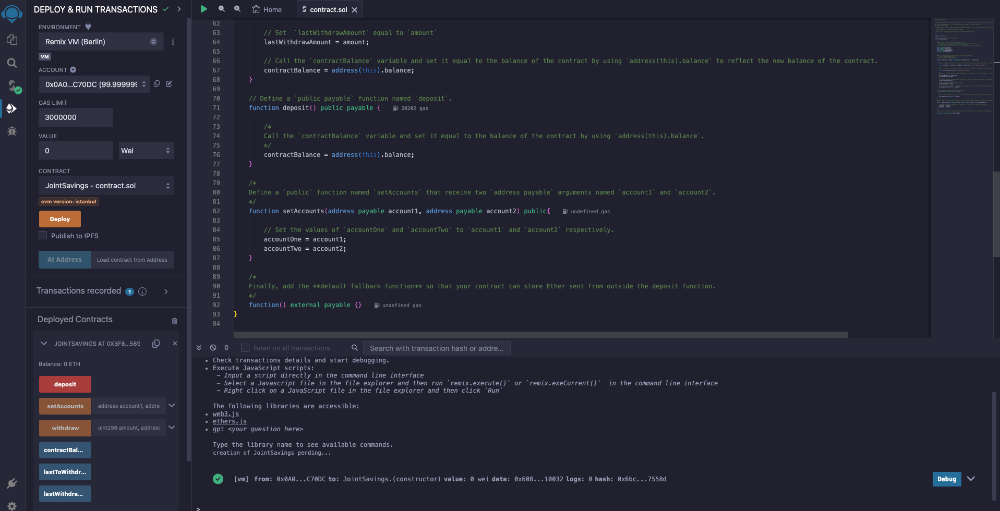

# Joint Savings Account Contract Recap

## Overview

This recap outlines the Solidity smart contract designed for creating and managing a joint savings account. The contract allows two parties to deposit, withdraw, and manage funds collectively in a secure and automated manner.

## Solidity Version

- Developed for Solidity version `^0.5.0`.

## Key Features

- **Joint Account Management**: Supports two users as joint owners of the savings account.
- **Deposit Functionality**: Allows ether deposits into the joint savings account.
- **Withdraw Functionality**: Enables withdrawals by either of the account owners, ensuring only authorized access to the funds.
- **Dynamic Balance Tracking**: Automatically updates the account balance upon each deposit or withdrawal.
- **Owner Authentication**: Restricts withdrawal operations to the designated account owners.
- **Last Activity Tracking**: Records the details of the last withdrawal action, including the recipient and amount.

## Functions

- `withdraw(uint amount, address payable recipient)`: Withdraws a specified amount to one of the account owners.
- `deposit() payable`: Accepts ether and adds it to the joint account's balance.
- `setAccounts(address payable account1, address payable account2)`: Sets or updates the addresses of the account owners.
- `fallback() payable`: A fallback function to receive ether sent directly to the contract outside of the `deposit` function.

## Security Features

- **Ownership Validation**: Ensures that only the designated account owners can initiate withdrawals.
- **Sufficient Balance Check**: Verifies that the contract contains enough balance for the withdrawal request.

## Deployment and Interaction

- The contract is intended for deployment in a local blockchain development environment, such as the JavaScript VM provided by Remix IDE.
- After deployment, account owners can deposit funds, set account owner addresses, and withdraw funds as needed.

## Transactions, Deposits, Withdrawals and Contract Balances
- **Contract Deployed**

- **Last to Withdraw and Last Withdraw Amount**

